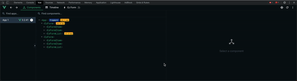

# EzForm Vue Devtool Plugin <Badge type="info" text="^1.3.0" />

**EzForm** is shipped with Vue Devtool Plugin, which help you inspect your form easier. DX with **EzForm** now is much better than before.

## Introduction

This plugin provide a form tree, show only main state of form. It also have some actions, help you interact with form easier:

- Submit Form
- Reset Form
- Validate Form
- Clear Form Validate



<style>
	.main img {
		width: 100%
	}
</style>

Each node of form tree also has three actions:

- Reset
- Validate
- Clear validate

## Setup

You can skip this section if you have registered global components via `EzFormPlugin` in [Setup - Register global component](/guide/setup#register-components)

**EzForm** also provide plugin `EzFormDevtool`, it will setup Devtool plugin only.

```ts
import { EzFormDevtool } from "@niku/ez-form";
import { createApp } from "vue";
import App from "./App.vue";

createApp(App).use(EzFormDevtool).mount("#app");
```
